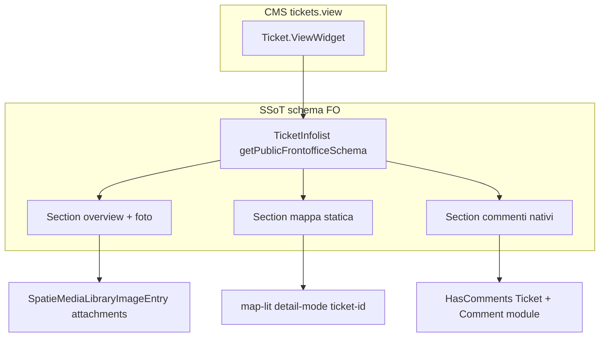

# FO dettaglio ticket: mappa, foto, commenti

## Scopo

Completare `/it/tickets/{id}` (widget `Ticket\ViewWidget` + `TicketInfolist`) con tre capacità che il cittadino si aspetta dopo la mappa elenco:

1. **Dove** è la segnalazione (mappa statica / punto singolo)
2. **Foto** allegate
3. **Commenti** (cronologia + in futuro invio)

**Regola:** tutto ciò che è read-only strutturato passa da **`TicketInfolist`** (Filament v5), non da Blade tema duplicato.

## Stato attuale (2026-06-05)

| Area | FO oggi | Gap residuo |
|------|---------|-------------|
| Layout | `getFrontofficeInfolistSchema()` — **no tab**, 3 sezioni verticali | Skin Design Comuni / navscroll opzionale |
| Mappa | `map-lit` + `detail-mode` + `ticket-id` | **`data-url` ancora in blade** → fetch inutile; preferire marker solo da lat/lng |
| Foto | `attachments` + fallback `ticket` | Seed media su ticket demo |
| Commenti | `Modules\\Comment` Livewire nativo (auth scrive, guest legge) | Skin DC / policy ruoli cittadino |

UX canon: [STORY-157](../../../../../docs/stories/STORY-157-ux-design-ticket-detail-no-tabs-map-comments.md) · `_bmad-output/ux-design-ticket-detail-fo.md`

## UX target (STORY-157)

**No tab FO** — layout verticale: overview → mappa statica → commenti sotto.

Vedi [STORY-157-ux-design-ticket-detail-no-tabs-map-comments.md](../../../../../../docs/stories/STORY-157-ux-design-ticket-detail-no-tabs-map-comments.md).

Admin mantiene tab; FO usa `TicketInfolist::getPublicFrontofficeSchema()`.

## Architettura target (filament-first)

### 1. Mappa statica (sezione location)

- **`ViewEntry`** in `getLocationSchema()` → `fixcity::filament.infolist.ticket-location-map`
- **`map-lit`** con `lat`, `lng`, `detail-mode`, `ticket-id` — filtra un solo feature da `tickets.json`
- Un solo marker; controlli search/filtri nascosti in detail-mode

### 2. Foto (overview tab)

- Allineare collection: **`attachments`** (come `TicketForm` e `BuildTicketPublicDetailsPayloadAction`)
- Registrare anche collection **`ticket`** sul modello per retrocompatibilità upload wizard/admin
- Due entry o merge visivo: attachments + fallback ticket

### 3. Commenti (modulo Comment) ✅ STORY-160

- `Ticket::comments()` = morph nativo; `Ticket::ticketComments()` = legacy admin
- FO: `ticket-comments.blade.php` → `@livewire(CommentsComponent::class)` nativo
- Insert + lista FO: [STORY-160](../../../../../../docs/stories/STORY-160-ticket-detail-comments-not-working.md)
- Guest: read-only + login `/it/auth/login`
- ADR: [ticket-fo-spatie-comments](../../../../../../docs/wiki/decisions/ticket-fo-spatie-comments.md) (contesto storico)

## Cosa non fare

- Nuovo `pub_theme::components.blocks.ticket.detail` come SSoT
- Controller dedicati FO
- Livewire standalone fuori widget Filament

## Dati demo

Per vedere foto su `/it/tickets/{id}`: allegati reali o seed con media su collection `attachments`.

## Collegamenti

- [tickets-view-cms-folio-page](./tickets-view-cms-folio-page.md)
- [ticket-fo-detail-filament-widget-infolist](../../../../../../docs/wiki/decisions/ticket-fo-detail-filament-widget-infolist.md)
- [filament-widgets-domain-folder-naming](../../../Xot/docs/wiki/concepts/filament-widgets-domain-folder-naming.md)
- [map-lit-tickets-json-ssot](../../../../../Themes/docs/shared-components/map-lit-tickets-json-ssot.md)
- STORY-134 / nuova STORY-138 (enrichment)

## Commenti — CanComment (2026-06-10)

Post-submit: policy `see()` richiede `User\Contracts\CanComment` in Blade, non `auth()->user()` grezzo. Vedi [comment-policy-blade-commentator.md](../../../../Comment/docs/concepts/comment-policy-blade-commentator.md). STORY: [STORY-295](../../../docs/stories/STORY-295-comment-policy-can-comment-blade.md).
