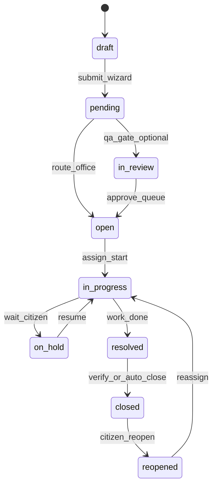

# Macchina a stati ticket — canon vs drift

## Scopo (business)

La PA italiana comunica al cittadino **fasi comprensibili**: inviata → presa in carico → in lavorazione → risolta → chiusa (eventualmente riaperta). Il motore stati deve essere **unico**, auditabile e allineato a [timeline cittadino](ticket-citizen-timeline.md) e Open311 [413](../../../../../../docs/stories/STORY-413-openapi-open311-interoperability.dev.md).

## Problema attuale (drift critico)

Tre implementazioni **non allineate** convivono nel modulo Fixcity:

| Fonte | Stati usati | Persistenza |
|-------|-------------|-------------|
| `TicketStatusEnum` | `open`, `draft`, `pending`, `in_review`, `in_progress`, `on_hold`, `resolved`, `closed`, `reopened` | Colonna/cast su `Ticket` via `setStatus()` |
| `WorkflowService::TRANSITIONS` | `draft`, `pending`, `assigned`, `in_review`, `in_progress`, `review`, `approved`, `rejected`, `resolved`, `closed`, `reopened`, `escalated`, `return_to_work` | `update(['status' => string])` — **stati assenti nell'enum** |
| Spatie `HasStatuses` | Storico status in tabella `statuses` | Trait su `Ticket` — **non usato** da `ChangeStatus` |

### Stati fantasma (in WorkflowService, non in enum)

`assigned`, `review`, `approved`, `rejected`, `escalated`, `return_to_work`

### Conseguenze

1. `WorkflowService` confronta `$ticket->status !== 'draft'` — con enum cast può essere **oggetto**, non stringa → transizioni imprevedibili.
2. `ChangeStatus` non scrive `TicketActivity` → timeline [396](../../../../../../docs/stories/STORY-396-ticket-citizen-timeline.dev.md) senza dati.
3. Test `TicketWorkflowIntegrationTest` esercita Service deprecato.
4. Open311 mapping impossibile finché non c'è un enum canonico.

**STORY-392** deve **scegliere un SSoT** e deprecare il resto.

---

## Canon proposto (PA + competitor IT)

Stati **minimi** per parity SegnalazioniWeb / Comuni-Chiamo / FixMyStreet, estendibili per enterprise (SeeClickFix):

| Stato enum | Label PA (i18n) | Milestone timeline | Open311 (indicativo) |
|------------|-----------------|--------------------|----------------------|
| `draft` | Bozza | — (non pubblico) | — |
| `pending` | In attesa di smistamento | `submitted` | `submitted` |
| `open` | Aperta / in coda | `acknowledged` | `open` |
| `in_progress` | In lavorazione | `work_started` | `in progress` |
| `on_hold` | In sospeso | `entity_response` (se motivo comunicato) | `pending` |
| `resolved` | Risolta | `work_completed` | `closed` (pending verify) |
| `closed` | Chiusa | `verified` | `closed` |
| `reopened` | Riaperta | `entity_response` | `reopened` |
| `in_review` | In verifica interna | internal only | — |

**Rimossi dal canon** (o mappati come flag, non stato): `assigned` → campo `responsible_id`; `escalated` → `priority` + Activity; `approved/rejected` → sotto-flusso `in_review` opzionale tenant enterprise.

### Transizioni ammesse (canon)

Implementazione: `ValidateTicketTransitionAction` con matrice `array<TicketStatusEnum, list<TicketStatusEnum>>` — **non** stringhe libere.

---

## Piano migrazione (392)

### Fase A — Allineamento enum

1. Documentare mapping `WorkflowService` legacy → enum canon (tabella sotto).
2. Aggiungere `TicketStatusEnum::ASSIGNED` **solo se** tenant enterprise lo richiede — default: usare `open` + `responsible_id`.
3. Rimuovere confronti stringa in WorkflowService; freeze Service.

### Fase B — Activity SSoT

Vedi [ticket-activity-event-contract.md](ticket-activity-event-contract.md).

### Fase C — Actions

| Da | A |
|----|---|
| `WorkflowService::assignTicket` | `AssignTicketAction` + Activity `assignment` |
| `WorkflowService::resolveTicket` | `TransitionTicketStatusAction` → `resolved` |
| `ChangeStatus::execute` | Deprecato → `TransitionTicketStatusAction` |
| `TicketCreatedListener` | `TransitionTicketStatusAction` `null→pending` + Activity |

### Fase D — Eliminazione

- Delete `app/Services/WorkflowService.php`
- Delete `app/Services/TicketService.php` (se solo workflow)
- Refactor `tests/Feature/TicketWorkflowIntegrationTest.php`

### Mapping legacy → canon

| Legacy WorkflowService | Canon enum | Note |
|------------------------|------------|------|
| `assigned` | `open` | set `responsible_id` |
| `review` | `in_review` | |
| `approved` | `open` | ready for field |
| `rejected` | `draft` | con reason in Activity |
| `escalated` | `open` | bump `priority` |
| `return_to_work` | `in_progress` | |

---

## Filament BO

| File | Azione 392 |
|------|------------|
| `Filament/Resources/TicketResource/Pages/ManageTicketStatuses.php` | Allineare a enum canon |
| `Filament/Actions/ChangeStatus.php` | Delegare `TransitionTicketStatusAction` |
| Nuovo `RelationManagers/ActivitiesRelationManager.php` | Lista Activity filtrata per ruolo |

---

## Test obbligatori

| Test | Assert |
|------|--------|
| `ValidateTicketTransitionActionTest` | `open→closed` forbidden; `resolved→closed` ok |
| `TransitionTicketStatusActionTest` | ogni arco canon crea 1 riga Activity |
| `TicketCreatedListenerTest` | create → status `pending` + activity |
| Regressione enum | nessun `status` stringa fuori enum in DB dopo migration data fix |

---

## Collegamenti

- Implementazione: [STORY-392 dev](../../../../../../docs/stories/STORY-392-ticket-workflow-activity-events.dev.md)
- Eventi payload: [ticket-activity-event-contract.md](ticket-activity-event-contract.md)
- Gap file: [codebase-gap-matrix.md](codebase-gap-matrix.md)
