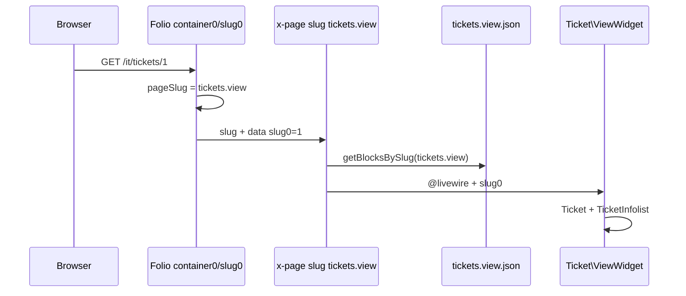

# Tickets View CMS Folio Page Concept

Documentation for the CMS-driven ticket detail page implementation using Folio routing system.

## GitHub (tracciamento)

| Repo | Issue | Discussion |
|------|-------|------------|
| base_fixcity_fila5 | [#237](https://github.com/laraxot/base_fixcity_fila5/issues/237) | [D#238](https://github.com/laraxot/base_fixcity_fila5/discussions/238) |
| module_fixcity_fila5 | [#21](https://github.com/laraxot/module_fixcity_fila5/issues/21) | commento su issue base #237 |
| theme_sixteen_fila5 | [#45](https://github.com/laraxot/theme_sixteen_fila5/issues/45) | commento su issue base #237 |

## Overview

This concept document explains how the ticket detail page (`/it/tickets/{id}`) is implemented using the CMS-driven Folio routing system in the FixCity project.

## Key Components

1. **CMS Page Configuration** - JSON definition for `tickets.view` slug
2. **Folio Route** - Dynamic route handling `[container0]/[slug0]` pattern
3. **Filament Widget** - `Ticket\ViewWidget` + `TicketInfolist` (blocco CMS `type: widget`)
4. **GeoJSON Integration** - Updated detail URLs in ticket GeoJSON feeds
5. **Legacy Handling** - Deprecation of old ticket detail routes

## Implementation Details

### CMS JSON Structure
The `tickets.view.json` file defines:
- `slug: "tickets.view"`
- Content block of type `widget` with `Ticket\ViewWidget` and view `ui::components.blocks.widget.simple`

### Filament Infolist (SSoT)
`Ticket\ViewWidget` resolves `Ticket` from `slug0`, checks `isVisibleOnPublicFrontoffice()`, and renders the same schema as admin `ViewTicket` via `TicketInfolist::getInfolistSchema()`.

Arricchimento FO (mappa, foto, commenti): [ticket-view-fo-enrichment-map-media-comments.md](./ticket-view-fo-enrichment-map-media-comments.md).

ADR: [ticket-fo-detail-filament-widget-infolist](../../../../../../docs/wiki/decisions/ticket-fo-detail-filament-widget-infolist.md). Naming: [filament-widgets-domain-folder-naming](../../../Xot/docs/wiki/concepts/filament-widgets-domain-folder-naming.md).

La view `pub_theme::components.blocks.ticket.detail` è **deprecata** (solo interim storico).

### URL Consistency
All ticket references throughout the system now point to `/it/tickets/{id}`:
- Map popups
- Ticket lists
- GeoJSON detail URLs
- Notification links

## dati demo

Popolamento ticket per mappa e dettaglio FO: [demo-tickets-presentation-seed.md](./demo-tickets-presentation-seed.md).

## Related Documentation

- [Folio Routing System](../laravel/Modules/Cms/docs/folio_routing_system.md)
- [CMS-Driven Pages System](../laravel/Modules/Cms/docs/cms-driven-pages-system.md)
- [ResolvePageAction](../laravel/Modules/Cms/app/Actions/ResolvePageAction.php)
- [Story STORY-134: Pagina FO `/it/tickets/{id}` — CMS slug `tickets.view`](../docs/stories/STORY-134-it-tickets-view-cms-folio-page.md)

## Acceptance Criteria Reference

See [STORY-134 Acceptance Criteria](../docs/stories/STORY-134-it-tickets-view-cms-folio-page.md#acceptance-criteria) for implementation requirements.

## Diagrams

### Request Flow

## Design / UX

| Decision | Default STORY-134 |
|----------|-------------------|
| **Auth** | FO **público** (like elenco `/it`) — no `middleware(['auth'])` sulla shell |
| **Identificatore URL** | **ID numerico** (`/it/tickets/1`) — `ResolvePageAction` already verifies `id` |
| **Parity visiva** | Ispirazione campi popup mappa + card accordion `ticket-card`; hero/breadcrumb opzionali in JSON |
| **Non è** | Copia 1:1 di `tests.segnalazione-dettaglio` (scheda servizio statica) |

## Vietato — no `pages/tickets/`

Non creare `Themes/Sixteen/resources/views/pages/tickets/`.  
URL `/it/tickets/{id}` è già servito da `[container0]/[slug0]/index.blade.php` + CMS `tickets.view` + `Ticket\ViewWidget`.

Canon: [page-directory-structure.md](../../../../Themes/Sixteen/docs/page-directory-structure.md) · [container0-pattern-philosophy.md](../../../../../../docs/wiki/memories/container0-pattern-philosophy.md).

## Tasks / Subtasks (aggiornato)

- [x] **JSON CMS** — `tickets.view.json` + blocco widget `Ticket\ViewWidget`
- [x] **Folio shell** — `[container0]/[slug0]/index.blade.php` (`name('container0.view')`, `@volt` statico)
- [ ] **Infolist FO** — `getPublicFrontofficeSchema()` (STORY-157: no tab, mappa 1 marker, commenti sotto)
- [ ] **SSoT URL** (AC 5–6)
  - Update `BuildTicketsGeoJsonAction`
  - Regenerate `tickets.json` if needed
- [ ] **Legacy cleanup** (AC 2)
  - Evaluate removal of redirect from `Modules/Fixcity/resources/views/pages/tickets/[slug].blade.php`
- [ ] **Docs + test** (AC 8–9)
  - Update `Fixcity/docs/wiki/concepts/tickets-view-cms-folio-page.md`
  - Add Pest test on `ResolvePageAction` for `tickets` + existing id; optional Playwright smoke URL
- [ ] **Build** `npm run build` Sixteen se CSS nuovo

## dati demo

[STORY-135](../../../../../docs/stories/STORY-135-ticket-presentation-seeder.md) — `php artisan db:seed --class="Modules\Fixcity\Database\Seeders\TicketDatabaseSeeder"` poi rigenerare GeoJSON (`GenerateTicketsJsonAction`).

## References

- [folio_routing_system.md](../laravel/Modules/Cms/docs/folio_routing_system.md)
- [cms-driven-pages-system.md](../laravel/Modules/Cms/docs/cms-driven-pages-system.md)
- [ResolvePageAction.php](../laravel/Modules/Cms/app/Actions/ResolvePageAction.php)
- [STORY-072-ticket-naming-convention.md](STORY-072-ticket-naming-convention.md)
- [STORY-052-ticket-details-api-folio.md](story-052-ticket-details-api-folio.md)
- [map-lit-tickets-json-ssot.md](../laravel/Themes/docs/shared-components/map-lit-tickets-json-ssot.md)

*Documentation auto-generated as part of STORY-134 implementation*
